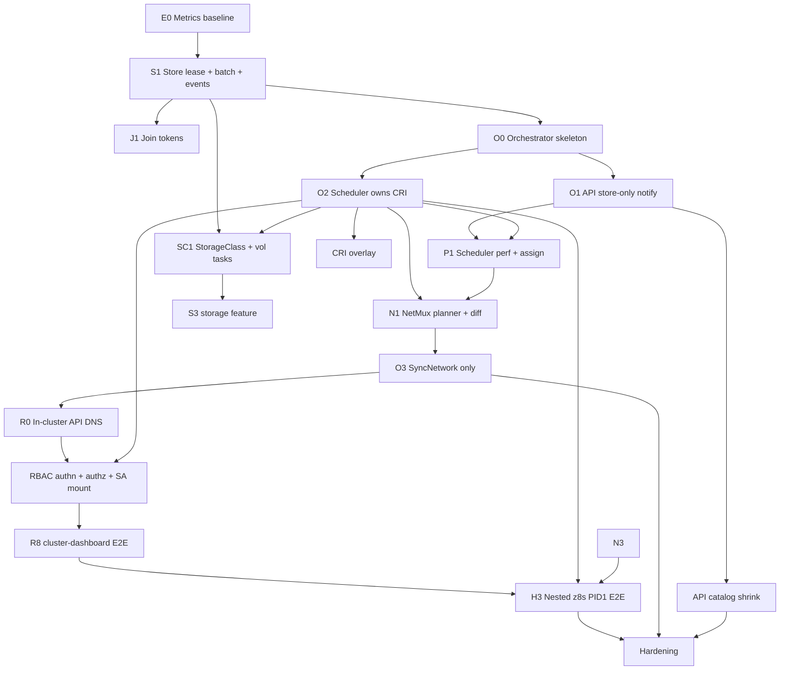

# z8s Production Modernization — Overview

> **Date:** 2026-06-02  
> **Scope:** Full `src/` audit (~22,232 LOC Rust)  
> **Goal:** Mature multi-node cloud control plane — faster than k3s for small clusters, lighter than k3s+s6 combined, with enforced isolation and kubectl-compatible APIs.

## Vision

z8s becomes a **single-binary edge/cloud orchestrator** that:

1. Runs as **PID 1** on bare metal or in a VM, hosting system daemons (sshd, dhcp, bash workloads) alongside Kubernetes workloads.
2. Scales to **N nodes** with shared desired state, **one global scheduler**, and **node-local execution** only where assigned.
3. Enforces **network + storage + cgroup** isolation by default; every pod lands in **`default` VNet** unless annotated otherwise.
4. Exposes **standard + extended CRDs** with **unified networking CRDs** (Service / LoadBalancer / API gateway / route table) to limit API surface area.
5. Targets **≤5,000 LOC** in `src/` through generics, composition, and dropping duplicate hand-rolled types — not by removing features.
6. Can run **z8s as PID 1 inside a z8s-managed pod** (nested control plane) and deploy workloads from that inner instance — proven by CI.

## Nested z8s (PID 1 in pod)

**Goal:** Host z8s schedules a **privileged pod** whose container entrypoint is `z8s run --daemon` as **PID 1**. The inner z8s runs a full control plane (API + scheduler + CRI + NetMux). From the host, `kubectl` targets the **inner API** and applies a test Deployment; the **inner** z8s must start that pod successfully.

```text
Host z8s (node)
  └── Pod: z8s-nested (privileged, PID1=/z8s)
        └── Inner z8s :6443  →  schedules  →  Pod: nginx (inner dataplane)
```

| Layer | Requirement |
|-------|-------------|
| **Image** | `deploy/z8s/Dockerfile` — release binary + minimal rootfs (distroless or alpine) |
| **Entrypoint** | `["/z8s", "run", "--daemon"]` — must stay foreground as PID 1 (no `default_start` fork) |
| **Privileges** | `privileged: true` or caps: `NET_ADMIN`, `SYS_ADMIN`, `SYS_CHROOT`, `MKDIR`, cgroup mounts |
| **Volumes** | `emptyDir` → `/var/lib/z8s`; hostPath or cgroupfs mount for `/sys/fs/cgroup` |
| **CIDR** | Inner `--pod-cidr` / `--service-cidr` **must differ** from host (e.g. `10.201.0.0/16`, `10.111.0.0/16`) |
| **API access** | `hostPort: 16443→6443` or port-forward for test script |

**Code gap (plan Z1):** when `getpid() == 1` and no subcommand, treat as `run --daemon` in foreground so container runtimes do not see immediate exit.

**Test:** [tests/test-z8s-nested-pid1.sh](../../tests/test-z8s-nested-pid1.sh) + [tests/nested/z8s-pid1-pod.yaml](../../tests/nested/z8s-pid1-pod.yaml). Gate: **H3** (after O2, N3 minimal, C1 optional).

Detail: [02-cri.md](./02-cri.md) § Nested PID 1.

## Current baseline (measured)

| Area | LOC (approx) | Notes |
|------|-------------|--------|
| `types.rs` | 2,703 | Largest file; hand-rolled k8s + z8s CRDs |
| `cri/runtime.rs` | 1,396 | Spawn paths, supervisor |
| `cri/rootfs.rs` | 1,023 | Mounts, pivot_root, userns |
| `cri/exec.rs` | 915 | kubectl exec protocol |
| `api/server.rs` | 1,067 | Router + inline handlers |
| `api/handlers/*` | ~3,500 | 23 thin CRUD files + fat pod/system |
| `netmux/*` | ~2,650 | NetMux + nft + netlink + DNS |
| `scheduler/*` | ~670 | Lease, tick, reconciler, process |
| `store/*` | ~1,050 | redb, gossip, ws, leases |
| `storage/*` | ~495 | loop + hostpath provisioners |
| `components/*` | ~1,400 | Reconcile per kind |
| `main.rs` + `node.rs` | ~1,210 | CLI + wiring |
| **Total** | **~22,232** | User cited ~19,617 (likely pre-growth or excluding tests) |

## Critical cross-cutting problems

### P0 — Multi-node scheduler is ~5× slower (should be ~2×)

Root causes identified in code:

| Issue | Location | Effect |
|-------|----------|--------|
| **Per-node scheduler lease in local redb** | `store/leases.rs`, `node.rs` | Each peer can run `run_scheduler()` on its own DB → duplicate assignment logic / fighting leases |
| **Full-store reconcile every 2s** | `components/mod.rs` `reconcile_all` → `get_all()` | O(resources) × nodes; doubles with gossip-full copy |
| **Per-pod service resync** | `pod.rs` → `sync_services_for_labels` → `get_by_kind("Service")` | O(pods × services) every tick even for remote-assigned pods |
| **Scheduler full scans** | `scheduler_tick`, `node_load_snapshot` | Multiple `get_by_kind("Pod")` / `Node` per 3s tick + `index.rebuild` after assignments |
| **redb `spawn_blocking` per apply** | `store/db.rs` | Serializes writes; N pod creates = N blocking DB round-trips |
| **Gossip per assignment** | `scheduler.rs` → `broadcast_write` | Amplifies cross-node traffic during scale-up |

**Target:** 2 nodes with 50 pods → scheduling + ready time ≤ **1.2×** single-node (not 5×).

### P1 — Networking code paths are fragmented

- Declarative `NetworkState` / `NftRule` in `netmux/mod.rs` coexist with imperative `NftEngine` jumps in `nftables.rs`.
- Service proxy still mixes userspace TCP with nftables DNAT in places.
- VNet default exists in API bootstrap but subnet/NSG/route reconciliation is spread across components.

### P2 — Type system duplication

- `types.rs` mirrors k8s-openapi-scale structs with many unused `Option` fields.
- `AnyResource` enum + repetitive matches in store, API, components.

### P3 — CRI spawn duplication

- `IsolationStrategy` exists but `runtime.rs` still carries multiple long fork paths; image unpack is per-container copy, not overlay.

### P4 — PID 1 / resilience

- Init + watchdog exist (`init.rs`, `node.rs` cleanup watchdog) but no structured **capability profiles** for host vs container workloads.
- D-state handling is defensive but reactive.

## Target architecture

```
┌─────────────────────────────────────────────────────────────────┐
│ main (CLI) · config · init (PID1)                    ~200 LOC   │
├─────────────────────────────────────────────────────────────────┤
│ node::Runtime — wires Store + builds EngineSet for Scheduler     │
├────────────────────────────┬────────────────────────────────────┤
│  API (store only)  ~600    │  Store + sync  ~500                  │
│  kubectl → apply/read      │  redb · gossip · events              │
└─────────────┬──────────────┴──────────────┬───────────────────────┘
              │ write + notify              │
              ▼                             │
┌───────────────────────────────────────────▼───────────────────────┐
│  Scheduler (orchestrator)  ~550                                      │
│  assign · reconcile · tasks — ONLY caller of CRI / NetMux / Vol    │
└──────┬─────────────────┬────────────────────┬────────────────────┘
       ▼                 ▼                    ▼
    CRI ~1200        NetMux ~950          Storage ~350
```

### Dependency flow (desired)

```text
API / watcher / gossip  →  Store  →  notify  →  Scheduler
                                                    ├→ CRI
                                                    ├→ NetMux
                                                    ├→ Storage
                                                    └→ Store (status writes)
```

- **API** persists desired state and enforces RBAC; it does **not** start pods, provision PVCs, or program nftables.
- **Scheduler** is the **only** module that triggers and handles tasks against CRI, NetMux, storage, and store (for status/assignment).
- **Leader** scheduler additionally assigns `pod.spec.nodeName` / `assigned_node` and scales Deployments; workers reconcile locally assigned work only.

See [05-scheduler.md](./05-scheduler.md).

**Rule:** Cross-node assignment goes through **leader scheduler + gossip**; workers never assign pods or scale Deployments.

## Single API surface: `z8s.io/v1` for everything

**All resources — standard Kubernetes kinds and z8s extensions — use one handler stack under `z8s.io/v1`.** There are no per-group handler modules (`pod.rs`, `deployment.rs`, `vnet.rs`, …).

| Layer | Responsibility |
|-------|----------------|
| **Resource catalog** | One table: plural → `Kind` + scope + reconcile category |
| **Generic handler** | Extend today’s `handlers/crd.rs` (`generic_*`) for all CRUD |
| **Compat router** | Mounts legacy paths (`/api/v1/...`, `/apis/apps/v1/...`) as **aliases** to the same handler |
| **Wire encoder** | On read, optionally sets `apiVersion` to match the request path (kubectl UX) |
| **Normalizer** | On write, always persist `apiVersion: z8s.io/v1` in the store |

```text
kubectl  →  /api/v1/namespaces/default/pods     ─┐
kubectl  →  /apis/apps/v1/.../deployments      ─┼→  ApiCompat (path → plural)
kubectl  →  /apis/z8s.io/v1/namespaces/.../pods ─┘         ↓
                                                    ResourceHandler::dispatch
                                                            ↓
                                                    store (always z8s.io/v1)
```

**Kinds in the catalog (examples):**

| Kind | Plural | Was (upstream group) |
|------|--------|----------------------|
| Pod | pods | core/v1 |
| Service | services | core/v1 |
| Deployment | deployments | apps/v1 |
| ConfigMap | configmaps | core/v1 |
| Ingress | ingresses | networking.k8s.io/v1 |
| VNet | vnets | z8s.io/v1 (native) |
| EdgeService | edgeservices | z8s.io/v1 (replaces separate Service/LB/gateway/route CRDs) |

Subresources (log, exec, scale, status) stay thin wrappers that call the same `ResourceHandler` + CRI/metrics — not separate CRUD handlers.

See [01-api.md](./01-api.md) for the full registry and migration from 23 handler files.

## RBAC: pods call z8s APIs by role

Workloads use **ServiceAccount tokens** mounted into the pod; every API call (`get pods`, `apply`, `list`, `exec`) is authorized via **Role / ClusterRole + bindings** — including **read** paths (today GET is unrestricted).

| Capability | Mechanism |
|------------|-----------|
| Pod identity | SA token at `/var/run/secrets/z8s.io/serviceaccount/token` |
| In-cluster URL | `EdgeService` ClusterIP + DNS (`kubernetes.default.svc.cluster.local`) |
| Policy | `PolicyRule` with `apiGroups`, `resources`, `verbs`, `resourceNames` |
| Pre-flight | Real `SelfSubjectAccessReview` (`kubectl auth can-i`) |
| Apply YAML | Per-object authz in multi-doc POST |

Deny-by-default when RBAC is configured; bootstrap `cluster-admin` for break-glass.

Full design: [07-rbac.md](./07-rbac.md).

## Unified kind: `EdgeService` (z8s.io/v1)

Combine Service + LoadBalancer + API gateway + route table into **one** `z8s.io/v1` kind (no parallel `Service` controller):

```yaml
apiVersion: z8s.io/v1
kind: EdgeService
metadata:
  name: api
spec:
  selector: { app: api }
  ports:
    - port: 443
      targetPort: 8080
  exposure:
    mode: LoadBalancer   # ClusterIP | NodePort | LoadBalancer | Gateway
    routes:
      - path: /v1
        backend: api-v1
  routeTable: egress-default
```

`kubectl apply` with `kind: Service` / `apiVersion: v1` is accepted at the edge, normalized to `EdgeService` (or legacy `Service` row in catalog pointing at the same reconcile path) — **one** network reconcile implementation.

## Default VNet policy

- On startup: ensure `VNet/default` + `Subnet/default` covering `pod_cidr` (already partially in `api/server.rs`).
- Pod without `z8s.io/vnet` annotation → `default`.
- All nftables SNAT/filter rules keyed by `(vnet, subnet)` not ad hoc per pod.

## Module plans (read in order)

| Doc | Module |
|-----|--------|
| [01-api.md](./01-api.md) | HTTP API, handlers, protobuf, watch |
| [02-cri.md](./02-cri.md) | Runtime, rootfs, exec, cgroups, images |
| [03-storage.md](./03-storage.md) | PV/PVC, provisioners, isolation |
| [04-netmux.md](./04-netmux.md) | **Critical** — NetMux: desired-state reconcile, nft/netlink appliers |
| [05-scheduler.md](./05-scheduler.md) | **Orchestrator** — sole caller of CRI, NetMux, storage, store writes for status |
| [06-store-sync.md](./06-store-sync.md) | redb, gossip, leases, **`z8s node <name> token`** join auth |
| [07-rbac.md](./07-rbac.md) | ServiceAccount tokens, authz engine, pod API access |

## Execution phases (dependency order)

Phases are **sequenced by hard dependencies**. Work within a wave can proceed in parallel only where noted. Module detail: [01](./01-api.md)–[07](./07-rbac.md).

### Dependency graph



### Wave 0 — Baseline (no code architecture deps)

| ID | Delivers | Depends on | Module doc |
|----|----------|------------|------------|
| **E0** | Bench `bench/schedule-50.sh`; capture 1-node vs 2-node p50/p99 | — | § P0 metrics |
| **E0b** | Document current violations (API→CRI, `reconcile_all`, etc.) | — | [05](./05-scheduler.md) §5.1 |

**Exit:** numbers to compare every later wave against.

---

### Wave 1 — Store & cluster foundation

Everything else assumes **main redb as SoT**, **store events**, and **correct multi-node auth**.

| ID | Delivers | Depends on | Module doc |
|----|----------|------------|------------|
| **S1a** | Scheduler lease only on **main** redb; workers skip `assign` loop | E0 | [06](./06-store-sync.md) §3, [05](./05-scheduler.md) |
| **S1b** | `apply_batch`, `StoreEvent` channel, `store.snapshot()` | S1a | [06](./06-store-sync.md) §1–2, §8 |
| **S1c** | Gossip: coalesce by key; apply → `scheduler_notify` only | S1b | [06](./06-store-sync.md) §4–5 |
| **J1** | `JoinTokenRecord`, `z8s node <name> token`, WS Bearer auth | S1a (main redb) | [06](./06-store-sync.md) § Node join tokens |

**Parallel:** J1 can start once S1a lands (does not need S1b).

**Exit:** 2-node join with token; no split-brain assignment; store writes batched.

---

### Wave 2 — Orchestrator hub (mandatory before NetMux/RBAC refactors)

| ID | Delivers | Depends on | Module doc |
|----|----------|------------|------------|
| **O0** | `EngineSet`, `Orchestrator` loop, `Task` enum, `dispatch` stub | S1b | [05](./05-scheduler.md) O0 |
| **O1** | API: `store.apply` + `scheduler_notify`; remove `registry.on_apply` from create path | O0 | [01](./01-api.md), [05](./05-scheduler.md) §4 |
| **O2** | Move `ProcessTracker` / `start_pod` / `stop_pod` into scheduler `SyncPod` | O0, O1 | [05](./05-scheduler.md) O1–O2, [02](./02-cri.md) |
| **P1a** | Drop `sync_services_for_labels` from pod path | O2 | [05](./05-scheduler.md), [04](./04-netmux.md) |
| **P1b** | `OrchestratorIndex`, event queues; remove `get_all()` hot path | O2, S1b | [05](./05-scheduler.md) P1 |
| **P1c** | Leader-only `AssignPod` + deployment scale tasks | S1a, P1b | [05](./05-scheduler.md) §2.5 |

**Exit:** P0 target — 2-node 50-pod ≤ **1.5×** single-node; only scheduler touches CRI.

---

### Wave 3 — NetMux (blocked on O2 + P1 + snapshot)

| ID | Delivers | Depends on | Module doc |
|----|----------|------------|------------|
| **N0** | `state.rs`, `RuleKey`, chain layout doc | O2 | [04](./04-netmux.md) N0 |
| **N1** | `NetworkPlanner` + golden tests (dry-run) | S1b, N0 | [04](./04-netmux.md) N1 |
| **N2** | `applier/netlink`; pod attach unchanged | N0 | [04](./04-netmux.md) N2 |
| **O3** | `Task::SyncNetwork` only path; delete `NetworkManager` IO | N1, N2, O2 | [04](./04-netmux.md) N3–N4, [05](./05-scheduler.md) |
| **N3** | EdgeService in planner; kernel DNAT; no userspace TCP proxy | O3, [01](./01-api.md) normalize Service | [04](./04-netmux.md) N4 |
| **N4** | NSG + NetworkPolicy via planner diff | N3 | [04](./04-netmux.md) N5 |
| **N5** | DNS from `NetworkState.dns`; default VNet/subnet | N3 | [04](./04-netmux.md) N6–N7 |
| **N6** | Multi-node pod routes via gossip (optional in wave) | J1, N3 | [04](./04-netmux.md) N8, [06](./06-store-sync.md) |

**Exit:** `curl` ClusterIP / NodePort; no component calls `netmux` except scheduler.

---

### Wave 4 — Storage (blocked on O2 orchestrator)

| ID | Delivers | Depends on | Module doc |
|----|----------|------------|------------|
| **SC1** | `StorageClass` in store; seed `standard` / `hostpath`; drop `builtin()` | O1 (catalog CRUD optional) | [03](./03-storage.md) steps 1–4 |
| **SC2** | `ProvisionerRegistry`; `Task::ProvisionVolume` / `DeprovisionVolume` | O2, SC1 | [03](./03-storage.md), [05](./05-scheduler.md) §3.3 |
| **SC3** | `WaitForFirstConsumer` + scheduler bind hook | P1c, SC2 | [03](./03-storage.md) |

**Parallel with late N3:** SC1–SC2 if O2 is done (no NetMux dependency).

**Exit:** PVC `storageClassName: standard` binds; provision only via scheduler.

---

### Wave 5 — In-cluster API + RBAC (blocked on O3 + N5 + O2)

| ID | Delivers | Depends on | Module doc |
|----|----------|------------|------------|
| **R0** | EdgeService `kubernetes` + DNS `kubernetes.default.svc.cluster.local` | N3, N5 | [04](./04-netmux.md), [07](./07-rbac.md) R7 |
| **R1** | Fix authz matching; deny-by-default; catalog path resolver | O1 | [07](./07-rbac.md) R1–R2 |
| **R2** | Enforce GET/list/watch; remove read bypass | R1 | [07](./07-rbac.md) R2 |
| **R3** | ClusterRole + ClusterRoleBinding in catalog | R1 | [07](./07-rbac.md) R3 |
| **R4** | SA token + `kubeconfig` mount in CRI | O2, R0 | [07](./07-rbac.md) R4, [02](./02-cri.md) |
| **R5** | Real SSAR / `kubectl auth can-i` | R2, R4 | [07](./07-rbac.md) R5 |
| **R6** | Multi-doc apply authz | R2, O1 | [07](./07-rbac.md) R6 |
| **R8** | **`test-rbac-cluster-dashboard.sh`** + fixtures | R4, R5, R0 | [07](./07-rbac.md) E2E |

**Exit:** cluster-dashboard Deployment runs **in-pod kubectl** with SA token; CI gate green.

---

### Wave 6 — API surface shrink (parallel after O1)

Can overlap Wave 3–5 but **do not** remove handlers still required for tests.

| ID | Delivers | Depends on | Module doc |
|----|----------|------------|------------|
| **A1** | `ResourceSpec` + `catalog.rs` | O1 | [01](./01-api.md) |
| **A2** | Migrate kinds to `ResourceHandler`; delete handler files | A1 | [01](./01-api.md) |
| **A3** | `WatchHub`, generated discovery | S1b, A2 | [01](./01-api.md) |
| **A4** | `types.rs` shrink / selective `k8s-openapi` | A2 | § P2 |

**Exit:** API ~500 LOC; all paths via catalog + compat router.

---

### Wave 7 — CRI performance (after O2)

| ID | Delivers | Depends on | Module doc |
|----|----------|------------|------------|
| **C1** | `SpawnPipeline` refactor (behavior parity) | O2 | [02](./02-cri.md) |
| **C2** | OverlayFS image store | C1 | [02](./02-cri.md) |
| **C3** | Capability profiles (host-sshd, container-minimal) | C1, admission | [02](./02-cri.md) |

**Exit:** 10× nginx replica rollout faster; optional host workload profiles.

---

### Wave 8 — Optional & hardening

| ID | Delivers | Depends on | Module doc |
|----|----------|------------|------------|
| **S3** | `z8s.io/s3` StorageClass (`feature = "s3"`) | SC2 | [03](./03-storage.md) Phase S |
| **Z1** | PID1 default: `argc==1` → `run --daemon` in foreground (container entrypoint) | — | [02](./02-cri.md) § Nested |
| **H1** | PID1 soak, D-state chaos, partition tests | O3, RB | § P4 |
| **H3** | **Nested z8s E2E:** privileged pod, inner z8s PID1, deploy nginx via inner API | O2, N3, Z1; image `deploy/z8s/Dockerfile` | § Nested z8s, [test script](../../tests/test-z8s-nested-pid1.sh) |
| **H2** | LOC audit ≤ 5,500; docs / install polish | A4, C2, N6, H3 | Success criteria |

---

### Summary timeline (indicative)

| Wave | Focus | ~Duration | Critical path? |
|------|--------|-----------|----------------|
| 0 | Metrics | 1 week | Baseline |
| 1 | Store + join | 1–2 weeks | **Yes** |
| 2 | Orchestrator | 2 weeks | **Yes** |
| 3 | NetMux | 3 weeks | **Yes** |
| 4 | Storage | 1 week | After O2 |
| 5 | RBAC + dashboard E2E | 2 weeks | After N5, R0 |
| 6 | API shrink | 2 weeks | Parallel |
| 7 | CRI overlay | 2 weeks | After O2 |
| 8 | S3 + nested PID1 + hardening | 2 weeks | H3 after O2+N3 |

**Total critical path:** E0 → S1 → O0 → O2 → P1 → N1 → O3 → R0 → R4 → R8 (~10–12 weeks). **H3** (nested z8s) branches from O2+N3 — not blocking RBAC path but required for production PID1 story.

**Recommended CI order:** E0 → … → R8 → **H3** → H1 → H2.

### What not to do early

| If you build this first… | Problem |
|--------------------------|---------|
| Full NetMux rewrite before orchestrator | Components still call netmux; double migration |
| RBAC SA tokens before R0 in-cluster API | Dashboard pod cannot reach API |
| Generic API catalog before O1 notify | Handlers still trigger CRI directly |
| S3 storage before SC2 registry | One-off provisioner hacks |
| EdgeService planner before `StoreSnapshot` | Planner keeps scanning store ad hoc |
| Nested z8s test before O2 + NetMux pod attach | Inner orchestrator cannot start pods |
| Unprivileged z8s-in-pod test | nft/netns/cgroup will fail — must use privileged pod |

### Phase ID quick reference

| Prefix | Module |
|--------|--------|
| E | Baseline metrics / E2E gates |
| Z | PID1 / nested z8s ([02](./02-cri.md)) |
| H | Hardening + nested E2E (H3) |
| S | [06 store-sync](./06-store-sync.md) |
| J | Join tokens (in 06) |
| O, P | [05 scheduler](./05-scheduler.md) |
| N | [04 netmux](./04-netmux.md) |
| SC | [03 storage](./03-storage.md) |
| R | [07 rbac](./07-rbac.md) |
| A | [01 api](./01-api.md) |
| C | [02 cri](./02-cri.md) |

## Success criteria

- **LOC:** `wc -l src/**/*.rs` ≤ 5,500 (buffer over 5k target).
- **Schedule:** 50-pod Deployment on 2× nodes ≤ 1.5× single-node wall time.
- **Memory:** idle z8s < 40 MiB RSS (2 nodes); < 25 MiB single-node.
- **Isolation:** `kubectl exec` cannot read host `/etc/shadow` from default pod; disk quotas enforced on loop volumes.
- **Compat:** existing test suite + `kubectl apply` nginx/whoami unchanged.
- **RBAC E2E:** `tests/test-rbac-cluster-dashboard.sh` — `eramax/cluster-dashboard` Deployment + ServiceAccount Role allows in-pod `kubectl get pods` ([07-rbac.md](./07-rbac.md)).
- **Uptime:** PID1 mode survives SIGCHLD storms; no nftable flush of non-z8s tables (incident rule).
- **Nested z8s:** `tests/test-z8s-nested-pid1.sh` passes — inner PID1 z8s deploys `nested-nginx` pod visible on inner `kubectl get pods`.

## Dependencies to add / remove

| Action | Crate | Reason |
|--------|-------|--------|
| Add (optional feature) | `k8s-openapi` with feature flags | Replace hand types |
| Add (optional) | `rio` / `tokio-uring` | Image layer I/O |
| Add | `dashmap` | Lock-free indexes (scheduler, net state) |
| Remove | duplicate YAML paths | Single codec path |
| Keep | `rustables`, `redb`, `axum`, `nix` | Core stack |

---

*Next: [01-api.md](./01-api.md)*
